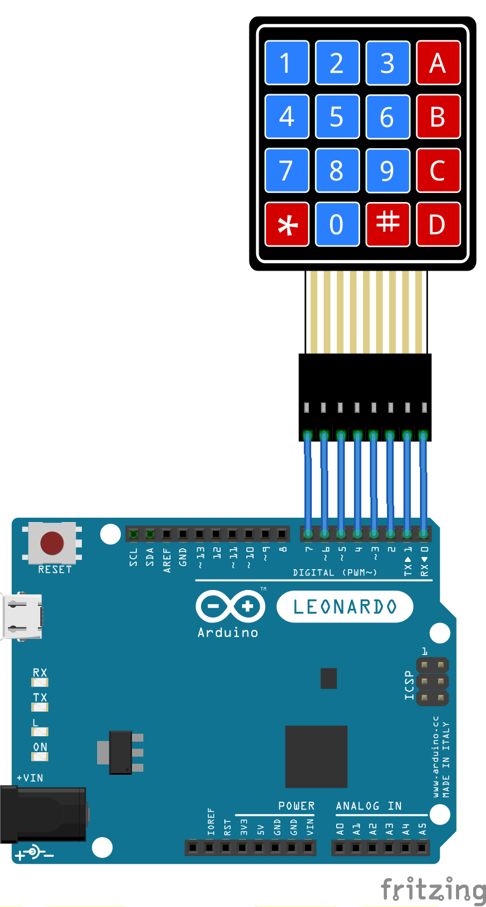

Mac [](https://dev.azure.com/tutagomes/soundboard/_build/latest?definitionId=11&branchName=master)

Windows [](https://dev.azure.com/tutagomes/soundboard/_build/latest?definitionId=11&branchName=master)


# Arduino Soundboard

A simple soundboard and macro electron app

Application data is stored at
    %APPDATA% no Windows
    $XDG_CONFIG_HOME ou ~/.config no Linux
    ~/Library/Application Support no macOS


### Interface

#### Install the dependencies
```bash
npm install
```


#### Start the app in development mode (hot-code reloading, error reporting, etc.)

```bash
quasar dev -m electron
```


#### Lint the files

```bash
npm run lint
```


#### Build the app for production

```bash
quasar build -m electron
```


### Arduino

First, you will need the `keypad.h` library available at https://playground.arduino.cc/Code/Keypad/#Download.

Then, open the project and flash your Arduino.

If you are using a Leonardo, just connect your keypad as shown:



Some of those sounds are from https://www.bensound.com